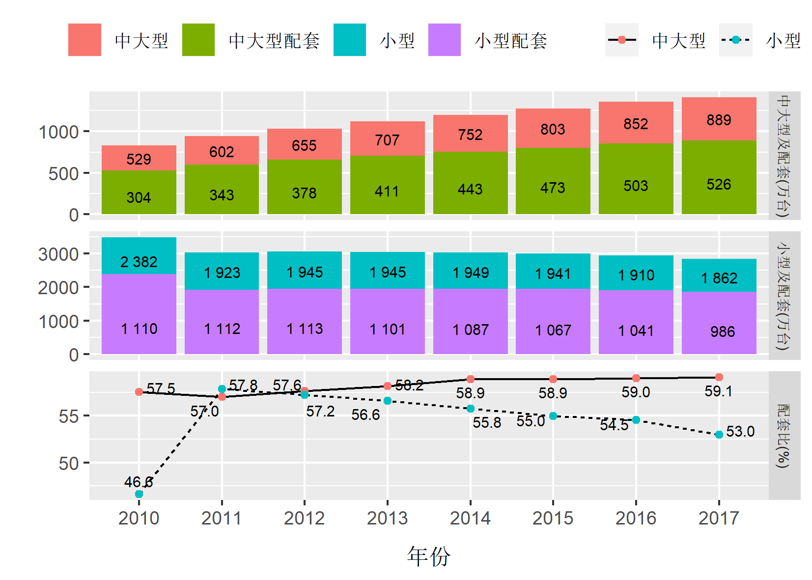

# 调整轴题与轴标签之间的间距

[Increase distance between text and title on the y-axis
](https://stackoverflow.com/questions/14487188/increase-distance-between-text-and-title-on-the-y-axis)

```
ggplot(mpg, aes(cty, hwy)) + geom_point()+
  theme(axis.title.y = element_text(margin = margin(t = 0, r = 20, b = 0, l = 0)))
```

# geom_text()如何控制字体大小

首先，geom_text()的size是按mm计量的。所以并不是跟font size一样的计量规则。所以不要混同二者的度量尺度。（参看[The size in geom_text is not a font size](https://github.com/tidyverse/ggplot2/issues/1828)）

其次，ggplot中字体控制的关系如下。简言之：geom_text()是单独控制字体的！！（参看：[ggplot geom_text font size control](https://stackoverflow.com/questions/25061822/ggplot-geom-text-font-size-control)）

```
p <- p + theme(axis.text = element_text(size = 15)) # changes axis labels

p <- p + theme(axis.title = element_text(size = 25)) # change axis titles

p <- p + theme(text = element_text(size = 10)) # this will change all text size 
                                                             # (except geom_text)
```

# 如何给geom_hline()添加图例

给geom_hline[添加图例](https://stackoverflow.com/questions/39119917/how-to-add-a-legend-to-hline)

# 保持读取csv编码正确

[编码正确](https://stackoverflow.com/questions/46996501/readrread-csv-issue-chinese-character-becomes-messy-codes)

# facet_grid() 实现多种图形并存

facet_grid()可以同时绘制多个子图，但是默认情况下每个子图都是同一种类型，如都是line，或都是point。

下面是多个子图不同类型的实现思路[^1] [^2]：

- 保持数据为long format data格式

- 设定一个factor作为子图分类。 factor levels 将决定子图的个数。

- 绘制空白图p1。含有factor levels个数的子图，data为全数据集。

- 通过subset()函数选定数据子集，并分别叠加绘制在p1上,直至所有空白子图都绘制完成。子图的geom_xxx()可以各不相同。

一个样本案例可以参照：


```
# for column select
got_vars <- c("bigtractor","bigtractor1", "smalltractor", "smalltractor1", "match_big", "match_small")

# gather for facet
smry_tractor <- smry %>%
  filter(region_pro == "旱区") %>%
  select(one_of(c("year", "region_pro", got_vars))) %>%
  gather(key="variables", value="value", bigtractor:match_small) %>%
  mutate(mark = as.factor(if_else(str_detect(variables, "bigtractor.?"), 
                        "bigtractor",
                        if_else(str_detect(variables, "^smalltractor"),
                                "smalltractor",
                                if_else(str_detect(variables, "^match"),
                                        "match",
                                        "NA"))))) %>%
  mutate(mark= fct_relevel(mark,"bigtractor", "smalltractor", "mathch"))

# list for facet labels                       
list_chn <- c(bigtractor="中大型及配套(万台)",
              smalltractor="小型及配套(万台)", 
              match="配套比(%)")

# base plot
p0 <-  ggplot(smry_tractor, aes(factor(year), value)) +
  facet_grid(mark~., 
              scales = "free",
              labeller = labeller(mark = list_chn)) +
  labs(x ="年份", y="") +
  theme(axis.title.x = element_text(margin = margin(t = 10, r = 0, b = 0, l = 0)),
        strip.text.y = element_text(size = 8)) # tune facet label font size

# raw 1 plot 
list_big <- c("bigtractor", "bigtractor1") # for subset
list_text <- c("中大型", "中大型配套", "小型", "小型配套") # for legend text
p1 <-  p0 +
   geom_bar( subset(smry_tractor, variables %in% list_big),
             mapping = aes(fill = variables),
             stat = "identity", position = "stack") +
  geom_text( subset(smry_tractor, variables %in% list_big),
             mapping = aes(label = round(value,0)),
             position = position_stack(vjust = 0.7), size =3) +
  scale_fill_discrete(name = "", labels = list_text)

# raw 2 plot 
list_small <- c("smalltractor", "smalltractor1") # for subset
p2 <- p1 +
  geom_bar( subset(smry_tractor, variables %in% list_small),
            mapping = aes(fill = variables),
            stat = "identity", position = "stack") +
  geom_text( subset(smry_tractor, variables %in% list_small),
             mapping = aes(label = round(value,0)),
             position = position_stack(vjust = 0.7), size =3) +
  scale_fill_discrete(name = "", labels = list_text)

# raw 3 plot  
list_match <- c("match_big", "match_small") # for subset
list_text <- c("中大型", "小型")  # for legend text
p3 <- p2 +
   geom_line( subset(smry_tractor, variables %in% list_match),
              mapping = aes(linetype = variables, group = variables)) +
   geom_point( subset(smry_tractor, variables %in% list_match),
               mapping = aes(color = variables, group = variables)) +
   geom_text_repel( subset(smry_tractor, variables %in% list_match),
                    mapping = aes(label = formatC(value,1, format = "f")), 
                    direction ="both", size =3) +
  scale_linetype_discrete(name = "", labels = list_text) +
  scale_color_discrete(name = "", labels = list_text) +
  guides(fill = guide_legend(order = 1))  # tune legend order
 
 p3
```


```{r, echo=F, fig.cap="include_graphics函数方法插入图片"}

```


[^1]: [ggplot2: Three Variable Time Series Panel Chart](https://learnr.wordpress.com/2009/05/18/ggplot2-three-variable-time-series-panel-chart/)

[^2]: [A GGPLOT TRICK TO PLOT DIFFERENT PLOT TYPES IN FACETS](https://statbandit.wordpress.com/2011/07/29/a-ggplot-trick-to-plot-different-plot-types-in-facets/)
