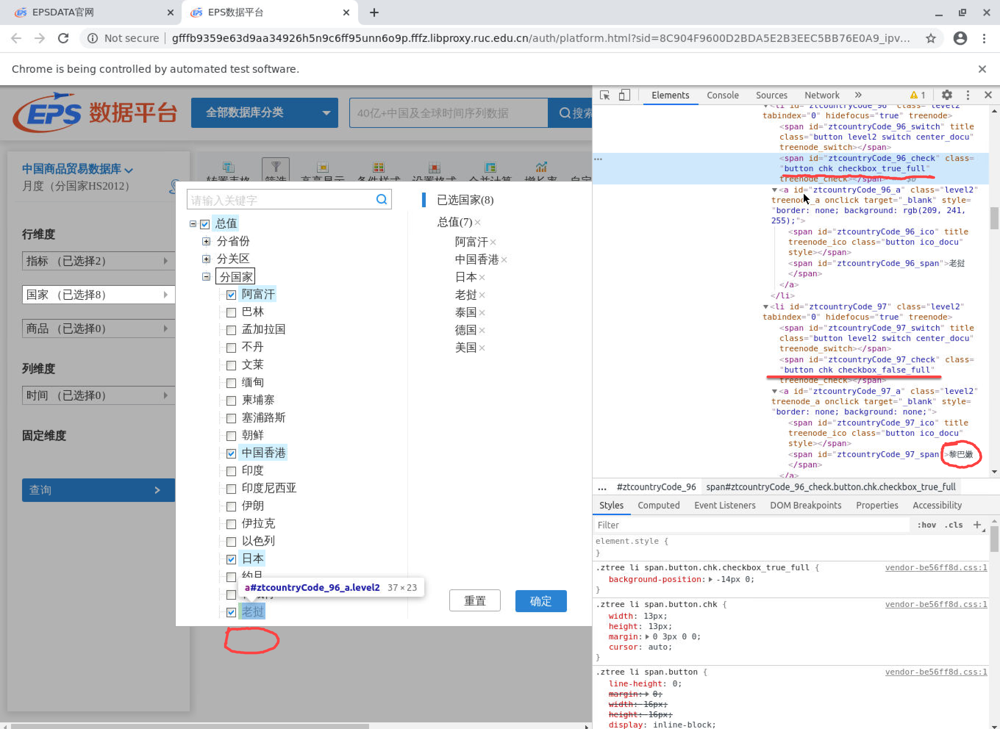

```{r, echo=FALSE, eval=TRUE, message=FALSE}
library("here")
source(here("static", "Rscript", "set-chunk-option.R"))
```


## 学习材料

RSelenium包在CRAN的官方[文档](https://cran.r-project.org/web/packages/RSelenium/vignettes/basics.html#introduction)

常用的操作，可以参考中文[教程](https://blog.csdn.net/weixin_40628687/article/details/79008995)。

## 经常碰到的爬虫场景和处理方法

下面列出一些常碰到的爬虫场景和处理办法。

### 正确关闭Rselenium server

```{r}
remDr$closeServer()
remDr$close()
rm(remDr)
rm(driver)
gc()
```


### 在浏览器窗口之间进行自由切换

具体见github issue社区互动 [参考](https://github.com/ropensci/RSelenium/issues/143)

```{r}
myswitch <- function (remDr, windowId) 
{
  qpath <- sprintf("%s/session/%s/window", remDr$serverURL, 
                   remDr$sessionInfo[["id"]])
  remDr$queryRD(qpath, "POST", qdata = list(handle = windowId))
}

Sys.sleep(1)
windows_handles <- remDr$getWindowHandles()
Sys.sleep(1)
#remDr$switchToWindow(windows_handles[[2]])

myswitch(remDr = remDr, windowId = windows_handles[[2]])


```


### 鼠标相关操作

1. 移动鼠标到指定位置 并点击

```{r}
xpath_submit <- "//*[@id='loginform-1']/div[4]/input"
webelm <- remDr$findElement(using = "xpath", value = xpath_submit)
loc <- remDr$mouseMoveToLocation(webElement = webelm)
remDr$click(1)
```


### 选择不可见的勾选框

> 参考[网络问答](https://stackoverflow.com/questions/46253566/selenium-cant-click-specific-checkbox)

对于一些网站，有时候存在肉眼不可见的网页元素。具体图示如下：


```{r, eval=T, echo=FALSE, fig.cap="一个示例"}
#knitr::include_graphics(here::here("static","pic","check-box-invisible.png"))

#
knitr::include_graphics("/pic/check-box-invisible.png", error = FALSE)
```


这时，我们需要使用`remDr$executeScript()`函数来执行`java`操作。

```{r}
webelem <- remDr$findElement(using = "xpath", "//*[@id='ztcountryCode_273_check']")

remDr$executeScript("arguments[0].click()", args = list(webelem))
  
```


### 日历和下拉菜单操作

一个比较全的[示例](https://towardsdatascience.com/climbing-mt-whitney-with-web-browser-automation-and-r-b11dcf9353b2)。

### 悬置鼠标唤出下级菜单 

[见示例](https://stackoverflow.com/questions/37307379/how-to-click-a-link-in-a-hover-menu-with-selenium-webdriver)。


