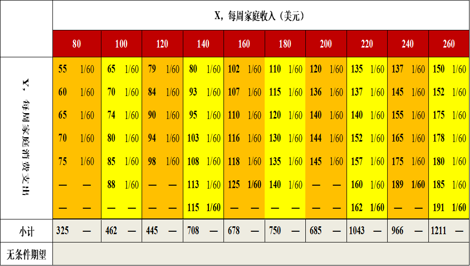

---
output:
  xaringan::moon_reader:
    seal: false
    lib_dir: libs
    css: 
      - default
      - default-fonts
      - duke-blue
      - hygge-duke
      - libs/cc-fonts.css
      - libs/figure-captions.css
    nature:
      highlightStyle: github
      highlightLines: true
      countIncrementalSlides: false
---
background-image: url("pic/slide-front-page.jpg")
class: center,middle

# 计量经济学(Econometrics)

### 胡华平

### 西北农林科技大学

### 经济管理学院数量经济教研室

### huhuaping01@hotmail.com

### `r Sys.Date()`

```{r global_options, echo=F,message=FALSE,warning=F}
knitr::opts_chunk$set(fig.align='center',echo = FALSE,message = FALSE,fig.width=10, fig.height=6) # Places figures on their own pages
options(
  htmltools.dir.version = FALSE, 
  formatR.indent = 2, width = 55, 
  digits = 2,scipen=999,tinytex.verbose = TRUE,
  knitr.kable.NA = '',
  echo=FALSE, warning=FALSE, message=FALSE)
library('bookdown')
library('knitr')
library('xlsx')
library("openxlsx")
#install.packages('tidyr')
#install.packages('plyr')
library('tidyr')
library('dplyr')
library('stringr')
library('tidyverse')
library('ggplot2')
library("scales")
#install.packages("gridExtra")
library("gridExtra")
#install.packages("magrittr")
library("magrittr")
#install.packages("ggthemes")
#install.packages("ggrepel")
require("ggthemes")
require("ggrepel")
require("lubridate")
require("DT")
require("wooldridge")
require("png")
require("jpeg")
require("latex2exp")
#require(kableExtra)
```

```{r ex-math-eq}
source("external-math-equation.R")
```

<style type="text/css">
.remark-slide-content {
    font-size: 22px;
    padding: 1em 4em 1em 4em;
}
</style>

---
class: center, middle,inverse
# 第2章：一元回归的基本思想

## 内容目录

.pull-left[
“回归”的历史渊源

术语与符号

数据的类型和性质

一个假想的微型总体

一些重要的概念
]
.pull-right[

总体回归线

总体回归函数

总体回归模型

样本回归线

样本回归函数

样本回归模型
]

---
# “回归”的历史渊源

高尔顿的发现:

- 父母高，儿女也高；父母矮，儿女也矮

- 但给定父母的身高，儿女的平均身高却趋向于或者"回归"到全体人口的平均身高。

皮尔逊的证实:

- 收集一些家庭群体的一千多名成员的身高记录。

- 两组样本：父亲高的群体VS父亲矮的群体

    - 父亲高的群体，子辈平均身高要低于其父辈；
    
    - 父亲矮的群体，子辈平均身高要高于其父辈。

‘回归到中等’(regression to mediocrity)的趋势，回归由此而得名

---
# “回归”的现代解释

我们现在可能关心的是这样一个问题：给定父辈身高，子辈身高是怎样的。

回归分析的本质：是关于研究应变量对另一个或多个解释变量的依赖关系，其用意在于：通过解释变量（在重复抽样中）的已知或设定值，去估计和（或）预测应变量（总体）均值。

---
class: duke-softblue

## 案例说明：子辈身高

- 给定父亲身高，在一个假想人口总体中的子辈身高分布。

```{r, fig.cap= "给定父亲身高时儿子身高的假想分布"}
include_graphics("pic/chpt2-1-case1-height.png",dpi=120)
```

---
class: duke-softblue
## 案例说明：年龄身高

- 给定年龄，男孩子身高总体的分布。

```{r, fig.cap= "对应于选定年龄的假想身高分布"}
include_graphics("pic/chpt2-1-case2-age.png", dpi=120)
```

---
class: duke-softblue

## 案例说明：消费函数

给定税后或可支配收入，个人消费是如何分布的。这种分析有助于估计边际消费倾向（MPC），就是实际收入每美元价值的变化所引起的消费支出的平均变化。

```{r, fig.cap="线性形式的凯恩斯消费模型"}
include_graphics("pic/chp1-model-eco.png",dpi=120)
```

---
class: duke-softblue

## 案例说明：货币工资

失业率是怎样影响货币工资变化的。

```{r, fig.cap="假想的菲利普斯曲线"}
include_graphics("pic/chpt2-1-case3-philips-curve.png",dpi=120)
```

---
class: duke-softblue

## 案例说明：货币持有

通货膨胀率如何影响人们以货币形式持有的收入比例的变化。根据货币经济学，其他条件不变，通货膨胀率
$\pi$越高，人们愿意以货币形式持有的收入比例
$k$越低


```{r, fig.cap="货币持有与通货膨胀率的关系"}
include_graphics("pic/chpt2-1-case4-inflation.png",dpi=120)
```

---
# 术语与符号：X和Y

```{r}
name_list <- tribble(
  ~Y,	~X,
"应变量(Dependent variable)",	"解释变量(Explanatory variable)",
"被解释变量(Explained variable)",	"自变量(Independent variable)",
"预测子(Predictand)",	"预测元(Predictor)",
"回归子(Regressand)",	"回归元(Regressor)",
"响应变量(Response variable)",	"刺激变量 (Stimulus  variable)",
"内生(Endogenous)",	"外生(Exogenous)",
"结果变量(Outcome)",	"协变量(Covariate)",
"被控变量(Controlled variable)",	"控制变量(Control variable)"
)

# datatable(name_list, options = list(pageLength =8, dom  = 'tip'))

kable(name_list, caption="X和Y的各种术语约定")
```

---
# 术语与符号：？元回归

双变量回归分析(two-variable regression analysis)：

- 研究一个变量对仅仅一个解释变量的依赖关系

- 如消费支出对实际收入的依赖关系

多元回归分析(multiple regression analysis)：

- 研究一个变量对多于一个解释变量的依赖关系

- 如农作物收成依赖于气温、降雨量、阳光和施肥量等；

---

# 术语与符号：模型符号

模型符号：

- 因变量：
$Y$，具体记为
$Y_i$,

- 解释变量：
$X$，记为
$X_1,X_2,\cdots,X_k$.
    - 
    $X_k$具体记为：
    $X_{k1},X_{k2},\cdots,X_{kn}$.
    - 
    $X_k$代表第
    $k$个解释变量，下标
    $i$（或
    $t$）则表示第
    $i$（或
    $t$）个观测值。

---

# 术语与符号：情景符号

情境符号：

- 总体容量：即总体中的观测值总个数

    - 
    $N$（横截面数据下使用）
    
    - 
    $T$（时间序列数据下使用）

- 样本容量：即样本中的观测值总个数

    - 
    $n$（横截面数据下使用）
    - 
    $t$（时间序列数据下使用）

横截面数据(cross-sectional data)：用观测值下标i来表示，这是指在一个时间点上搜集的数据。
时间序列数据(time series data)，用下标t来表示，这是一个时期内收集的数据。

---

# 术语与符号：两套体系

李子奈的k元回归：

$$\begin{align}
Y_i &=  \beta_0 +\beta_1X_{i1} +\beta_2X_{i2} + \cdots +\beta_kX_{ik}+ u_i 
\end{align}$$

古扎拉蒂的k变量回归：

$$\begin{align}
Y_i &=  \beta_1 +\beta_2X_{2i} +\beta_3X_{3i} + \cdots +\beta_kX_{ki}+ u_i
\end{align}$$


---
class: inverse, middle, center
# 数据的类型

---

## Type1：时间序列数据(time series data)：

时间序列数据：对一个变量在不同时间取值的一组观测结果。

- 实时牌价：如股票价格

- 每日(daily）：如天气预报

- 每周(weekly）：如货币供给数字

- 每月(monthly）：如失业率和消费者价格指数

- 每季度(quarterly）：如GDP

- 每年(annually）：如政府预算

- 每5 年(quinquennially）：如制造业普查资料

- 每10 年( decennially）：如人口普查资料

---

## Type1：时间序列数据(time series data)：

平稳性(stationary)：如果一个时间序列的均值和方差不随时间而系统地变化，那它就是平稳的(stationary) 。

```{r, fig.cap="1951年1月-1999年9月美国的M1货币供给"}
include_graphics("pic/chpt2-1-data-series-M1.png", dpi=120)
```

---
## Type2：截面数据(cross-section data)：

横截面数据：对一个或多个变量在同一时间点上收集的数据

异质性(heterogeneity) ：当我们的统计分析包含有异质的单位时，我们必须考虑尺度(size)或规模效应(scale effect) 以避免造成混乱。

---

### 案例：鸡蛋价格与鸡蛋产量

```{r}
eggs <- as.tibble(read.xlsx("data/Table-1-1-eggs.xlsx"))
eggs %>%
  select(STATE, Y1, X1) %>%
  datatable(options = list(pageLength=5, dom="tip"),
            caption = "美国50个州的蛋类生产和价格数据")
```

其中，
$Y_1$代表1990年鸡蛋产量(百万个)；
$X_1$代表1990年每打鸡蛋的价格(美分/打)。

---

### 案例：鸡蛋价格与鸡蛋产量


```{r, fig.cap= "1990年蛋产量与价格的关系",fig.height=6, fig.width=10}
eggs %>%
  select(STATE, X1, Y1) %>%
  ggplot(aes(x=Y1, y=X1)) +
  geom_point(color="blue", size=2) +
  theme(text = element_text(size=16)) +
  labs(x="鸡蛋产量(百万个)", y="鸡蛋价格(美分/打)")

```

.content-box-blue[思考提问：]

???

- 图中特征符合经济学理论么？为什么？

- 图中反映了数据可能存在哪些潜在问题？


---
## Type3：面板数据(Panel Data)

面板数据：是兼有时间序列和横截面数据两种成份，指对相同的横截面单元在时间轴上进行跟踪调查的数据。

- 平衡面板(balanced panel)：所有截面单元都具有相同的观测次数

- 非平衡面板(unbalanced panel)：并非所有截面单元都具有相同的观测次数

数据点（观测数）
$n$：

- 数据点（观测数）=截面单元数*时期数

- 
$n=q*t$

可能存在的问题：

- “平稳性”问题：

- “异方差”问题：

---

### 案例：钢铁公司

两家钢铁公式的数据案例：

- 公司：GE=通用公司；US=美国钢铁

- I=真实总投资（百万美元）

- F=前一年的企业真实价值 （百万美元）

- C=前一年的真实资本存量（百万美元）


```{r}
steel <- as.tibble(read.xlsx("data/Table-1-2-steel.xlsx"))
steel_wide <-steel %>%
  filter(company =="US"| company =="GE") %>%
  gather(key= "var", value="value",I:C) %>%
  unite(col="var", company, var, sep=".") %>%
  spread(key=var, value= value, sep= "_") 

names(steel_wide)<- c("year",
                           "GE.C", "GE.F", "GE.I", 
                           "US.C", "US.F", "US.I")
steel_long <-steel %>%
  filter(company =="US"| company =="GE") 
  
```

---

### 案例：钢铁公司

扁数据形式：

```{r}
datatable(steel_wide, 
          options = list(pageLength=7, dom="tip"),
          caption = "1935-1954年间美国两大钢铁公司的数据(扁数据)")
```

---

### 案例：钢铁公司

```{r, fig.cap="两家公司的企业投资情况"}
ggplot(data = steel_long, 
       aes(x=year, y=I, group=company,color=company)) +
  geom_line()+
  geom_point() +
  labs(x="年份", y="企业投资（百万美元）")
```

---

### 案例：钢铁公司

长数据形式：

```{r}
datatable(steel_long, 
          options = list(pageLength=7, dom="tip"),
          caption = "1935-1954年间美国两大钢铁公司的数据(长数据)")
```


---

### 案例：钢铁公司

缺失部分数据：

```{r}
steel_wide %>%
  mutate(US.C=ifelse(year %in% c(1940,1953), NA, US.C),
         US.F=ifelse(year %in% c(1940,1953), NA, US.F),
         US.I=ifelse(year %in% c(1940,1953), NA, US.I)) %>%
  datatable(options = list(pageLength=7, dom="tip"),
          caption = "1935-1954年间美国两大钢铁公司的数据(缺失部分数据)")
```

.content-box-blue[课堂测试：]

???

- 问1：平衡面板还是非平衡面板？

- 问2：多少数据点？

- 问3：两个公司投资函数是否相同？

---
class: inverse, middle, center
# 数据的性质和层次

---

## 名义尺度(nominal scale) 

名义尺度变量只表示不同的类别，它不能加减乘除，也不能比较大小。

- 如性别(男、女）和婚姻状况（已婚、未婚、离婚、分居）之类的变量。

---

## 序数尺度(ordinal scale)

名义尺度变量只能比较大小(即自然顺序)，不能加减乘除。

- 五分量表

```{r, fig.cap="李克特量表"}
include_graphics("pic/chpt2-1-data-scale-order1.png", dpi=60)
```

---

## 序数尺度(ordinal scale)

- 无差异曲线

```{r, fig.cap="两种商品消费下的无差异曲线"}
include_graphics("pic/chpt2-1-data-scale-order-curve.png", dpi=60)
```

---

## 区间尺度( interval scale) 

区间尺度变量比率尺度变量可以比较大小，也能加减，但不能乘除。。

- 两个时期之内的距离(如2000 – 1995)是有意义的，但两个时期的比率(2000/1995) 就没有什么意义。

- 2013年8 月11 日上午11点天气预报说杨凌的温度是华氏60度，而长沙达到华氏90度。说长沙比杨凌暖和50%没有意义，所以，温度不是比例尺度。这主要是因为华氏温标不是以0度作为起点所致。

---

## 比率尺度(ratio scale)：

比率尺度变量可以比较大小，也能加减乘除。

- 对于一个变量X，取其两个值
$X_1$和
$X_2$，比率
$X_1/X_2$和距离
$(X_2-X_1)$都是有意义的量。

- 此外，这些值在这种尺度下存在着一种自然顺序（上升或下降) (性质3) 。因此如
$X_2≤X_1$或
$X_2≥X_1$之类的比较也是有意义的。

- 如：GDP(亿元)、个人收入(元)等

---
# 一个假想的微型世界

```{r}
families60 <- as.tibble(read.xlsx("data/Table-2-1-60families.xlsx", sheet = 1))

col_sum_f60 <- families60 %>% 
  colSums(na.rm=T)
col_mean_f60 <- families60 %>% 
  colMeans(na.rm=T)

cond_mean <- families60 %>% 
  add_column(`80 `=rep(c(1/5,NA),times=c(5,2)), .before = "100") %>%
  add_column(`100 `=rep(c(1/6,NA),times=c(6,1)), .before = "120") %>%
  add_column(`120 `=rep(c(1/5,NA),times=c(5,2)), .before = "140") %>%
   add_column(`140 `=rep(c(1/7),times=c(7)), .before = "160") %>%
   add_column(`160 `=rep(c(1/6,NA),times=c(6,1)), .before = "180") %>%
  add_column(`180 `=rep(c(1/6,NA),times=c(6,1)), .before = "200") %>%
  add_column(`200 `=rep(c(1/5,NA),times=c(5,2)), .before = "200") %>%
  add_column(`220 `=rep(c(1/7),times=c(7)), .before = "240") %>%
  add_column(`240 `=rep(c(1/6,NA),times=c(6,1)), .before = "260") %>%
  add_column(`260 `=rep(c(1/7),times=c(7))) 

col_cond_mean <- cond_mean %>%
  colMeans(na.rm = T) %>%
  rbind(cond_mean, .)


```


```{r, eval=FALSE, warning=FALSE}
datatable(families60, options = list(pageLength=7, dom="tip"))
```


```{r, eval=FALSE}
col_sum_f60 %>%
  rbind(families60, . , col_mean_f60) %>%
  add_column(id=c(paste0("f",1:7),"列求和", "列均值"), .before = "80") %>%
  datatable(col_sum_f60, options = list(pageLength=9, dom="tip"))
```

<!---新数据表--->

```{r}
fams60<- as.tibble(read.xlsx("data/Table-2-1-60families-new.xlsx",sheet = "Sheet1"))

fams60_long <- as.tibble(read.xlsx("data/Table-2-1-60families-new.xlsx", sheet = "Sheet2"))

```

直观列表：

```{r, fig.cap="60个家庭的收入和支出情况：假设的总体"}
include_graphics("pic/chpt2-1-60families-pop.png",dpi=150)
```

???
提问：

- 总体是什么？

- 有多少总体单位？

---
# 一个假想的微型世界：

扁数据形态：“非标准”数据形态（但很直观）

```{r}
datatable(fams60, options = list(pageLength =9, dom ="tip"), caption = "60个家庭的收入和支出情况：假设的总体")
```

---
# 一个假想的微型世界：

长数据形态：标准数据形态（但不直观）

```{r}
datatable(fams60_long, options = list(pageLength =7, dom ="tip"), caption = "60个家庭的收入和支出情况：假设的总体")
```

---

# 重要概念

**无条件概率**：

- 定义：不受
$X_i$变量取值影响下，
$Y_i$出现的可能性。

- 记号：离散变量
$P(Y_i)$；连续变量
$g(Y)$

**无条件期望**：

- 定义：不受
$X_i$变量取值影响下，变量
$Y_i$的期望值。

- 记号：
$g(Y_i)$表示连续变量的概率密度函数（cdf）

$$\begin{align}
E(Y) &= \sum_1^N{Y_i \cdot P(Y_i)} &&\text{(discrete vars)} \\
E(Y) &= \int{Y_i \cdot g(Y_i)dY} &&\text{(continue vars)} 
\end{align}$$

---

# 重要概念

无条件概率和无条件期望的实例计算：

```{r, fig.cap="无条件概率和无条件期望"}

```

---

# 重要概念

无条件期望的计算过程：

$$\begin{align}
E(Y) &= \sum_1^N{Y_i \cdot P(Y_i)} \\
     &= \sum_1^{60}\left( 55*\frac{1}{60} + 60*\frac{1}{60} + \cdots + 191*\frac{1}{60} \right) \\
     &=\frac{1}{60}\sum_1^{60}Y_i\\
     &=\frac{7272}{60}\\
     &=121.2
\end{align}$$

---

# 重要概念

**条件概率**：

- 定义：给定变量
$X_i$的取值条件下，
$Y_i$出现的可能性。

- 记号：离散变量
$P(Y_i|X_i)$；连续变量
$g(Y|X)$


**条件期望**：

- 在给定变量
$X_i$的取值条件下，
$Y_i$的期望值。

- 记号：
$g(Y|X)$表示连续变量的条件概率密度函数（cdf）

$$\begin{align}
E(Y|X_i) &= \sum_1^N{(Y_i|X_i) \cdot P(Y_i|X_i)} &&\text{(discrete vars)} \\
E(Y|X_i) &= \int{(Y|X) \cdot g(Y|X)dY} &&\text{(continue vars)} \end{align}$$

---

# 重要概念

条件概率和条件期望的实例计算：

```{r, fig.cap="条件概率和条件期望"}
include_graphics("pic/chpt2-1-60fams-conditional-mean.png")
```

---

# 重要概念

条件期望的计算过程：

$$\begin{align}
E(Y|80) &= \sum_1^N{Y_i \cdot P(Y_i|X=80)} \\
     &= \sum_1^{5}\left( 55*\frac{1}{5} + 60*\frac{1}{5} + \cdots + 75*\frac{1}{5} \right) \\
     &=\frac{1}{5}\sum_1^{5}Y_i\\
     &=\frac{325}{5}\\
     &=65
\end{align}$$

---

### 假想总体的全部数据展示

```{r}
exp_cond <- fams60 %>%
  filter(Mark!="X") %>%
  select(-Mark) %>%
  colMeans(.,na.rm = T) %>%
  rbind(fams60[1,-1], .) %>%
  add_column(var = c("X","E(Y|X)"), .before = "G1")

pivot_exp <- as.tibble(t(exp_cond))[-1,] %>%
  dplyr::rename( X=V1,exp.Y="V2") %>%
  type_convert(cols(X=col_double(),
                    exp.Y= col_double()))
```


```{r}

# the population points
p1<- ggplot() +
  geom_point(data = fams60_long,
             aes(x=X,  y=Y,color= "Y", shape="Y"),size=3) +
  scale_colour_manual(name= "",
                      values =c("blue")) +
  scale_shape_manual(name= "",
                      values =c(1)) +
  scale_x_continuous(breaks=seq(80,260, length=10)) +
  labs(x="家庭收入X", y="家庭支出Y") +
  theme(text = element_text(size=16))

p1
```


---
### 给定不同X水平下Y条件期望值

```{r}
# the expect points
p2 <- p1 +
  geom_point(data = pivot_exp, 
             aes(x=X, y=exp.Y,
                 color= "E(Y|X)",shape= "E(Y|X)"), size=3) +
  scale_colour_manual(name= "",
                      values =c("red","blue")) +
  scale_shape_manual(name= "",values =c(19,1)) 

p2
```

```{r}
knitr::kable(exp_cond)
```

---
### 给定不同X水平下Y条件期望值

```{r , warning=FALSE,message=FALSE}
# the specified point
X_spc <- 120
Y_spc <- pivot_exp$exp.Y[which(pivot_exp$X==X_spc)]
p2_1 <- p2 +
  geom_vline(aes(xintercept = X_spc), lty="dashed")+
  geom_hline(aes(yintercept = Y_spc), lty="dashed")+
  geom_text(aes(x=X_spc-22, y=Y_spc+10), label=TeX("$(X_i,E(Y|X_i))=(120,89)$"),
            color="red",size=5)

p2_1
```

给定
$X=120$水平下
$Y$条件期望值
$E(Y|X_i=120)$= `r pivot_exp$exp.Y[which(pivot_exp$X==X_spc)]`

---
### X均值和Y的无条件期望值

```{r, fig.cap="X均值和Y的无条件期望值", warning=FALSE,message=FALSE}
# the center point
X_bar <- mean(fams60_long$X)
Y_bar <- mean(fams60_long$Y)
p3 <- p2 +
  geom_vline(aes(xintercept = X_bar), lty="dashed")+
  geom_hline(aes(yintercept = Y_bar), lty="dashed")+
  geom_text(aes(x=X_bar-20, y=Y_bar+10), label=TeX("$(\\bar{X},\\bar{Y})=(174, 121)$"),color="orange",size=5)+
  #geom_text(aes(x=15, y=mean(fams60_long$Y)+5), label=TeX("$E(Y)=\\bar{Y}$"))+
  geom_point(aes(x=X_bar, y=Y_bar,
                 color="center", shape="center"),size=3) +
  scale_colour_manual(name= "",
                      values =c("E(Y|X)"="red", "Y"="blue", "center" ="orange")) +
  scale_shape_manual(name= "",
                      values =c("E(Y|X)"=19,"Y"=1,"center" =17)) 
p3
```

X的均值
$\bar{X}$
=`r X_bar`和Y的无条件期望值
$E(Y)=$
`r Y_bar`

---

# 总体回归线（PRL）

- 几何：给定X值时Y的条件期望值的轨迹。

- 统计：实质上就是Y对X的回归。

总体回归曲线(Population Regression Curve，PRC)：条件期望值的轨迹表现为一条曲线(Curve)。

总体回归线(Population Regression Line，PRL)：条件期望值的轨迹表现为一条直线(Line)。

---

# 总体回归线（PRL）

```{r, fig.cap="总体回归线PRL"}
p_PRL <- p2 +
  geom_line(data = pivot_exp,aes(x=X, y=exp.Y),color="purple", size=0.75)
p_PRL
```

---
# 总体回归函数（PRF）

总体回归函数（Population Regression Function，PRF）：它是对总体回归曲线(PRC)的数学函数表现形式。

如果不知道总体回归曲线的具体形式，则总体回归函数PRF表达为如下隐函数形式（PRF）：

$$\begin{align}
E(Y|X_i) & = f(X_i)  && \text{(PRF)}
\end{align}$$

如果总体回归曲线是直线形式，则总体回归函数PRF表达为如下显函数形式（PRF_L）：

$$\begin{align}
E(Y|X_i) &= \beta_1 +\beta_2X_i && \text{(PRF_L)}
\end{align}$$

- $\beta_1,\beta_2$分别称为截距(intercept)和斜率系数(slope coefficient)。

- $\beta_1,\beta_2$称为总体参数或回归系数(regression coefficients)。

- $\beta_1,\beta_2$为未知但却是固定的参数。

---
# 总体回归函数（PRF）

```{r, fig.cap="总体回归线PRL与总体回归函数PRF", warning=FALSE,message=FALSE}
lm_pop<- lm(data = pivot_exp, formula = exp.Y~X)
b1 <- coef(lm_pop)[1]
b0 <- coef(lm_pop)[2]
p_PRF <- p_PRL +
  geom_text(aes(x=120, y=200),
            label=TeX("$PRF:E(Y|X_i)=\\beta_1+\\beta_2X_i$"),
            color="purple", size=5) +
    geom_text(aes(x=120, y=190),
            label=TeX("$E(Y|X_i)=17+0.6X_i$"),
            color="purple", size=5) 
p_PRF
```

---
# 总体回归模型（PRM）

**总体回归模型**（Population Regression model, PRM）：把总体回归函数表达成**随机设定**形式。

如果总体回归函数为隐函数，则**总体回归模型**记为：

$$\begin{align}
Y_i &=  E(Y|X_i) + u_i \\
    &=  f(X_i) +u_i
\end{align}$$

如果总体回归函数为线性函数，则**总体回归模型**记为：

$$\begin{align}
Y_i &=  E(Y|X_i) + u_i \\
    &= \beta_1 +\beta_2X_i + u_i
\end{align}$$

- 总体回归模型（PRM）属于**计量经济学模型**，而总体回归函数（PRF）是**数量经济学模型**（或数学模型）。

- 总体回归模型（PRM）能充分表达的是现实世界中
$Y_i$变量的行为特征。


---
## 随机干扰项

总体回归模型（PRM）设定下，
$Y_i$将由两个部分组成。

.content-box-blue[
特定家庭的支出（
$Y_i$） = 系统性部分（
$E(Y|X_i)$ + 随机部分（
$u_i$）]

特定家庭的支出（
$Y_i$） = 系统性部分（
$\beta_1+\beta_2X_i$） + 随机部分（
$u_i$）


**随机干扰项**：

- 也被称为随机误差项(stochastic error term)：总体回归函数中忽略掉的但又影响着Y的全部变量的替代物，它是
$Y_i$与条件期望（
$E(Y|X_i)$）的离差。

$$\begin{align}
u_i &= Y_i - E(Y|X_i) 
\end{align}$$

---
## 随机干扰项

随机干扰项的来源：

- 理论的含糊：除了主变量之外，还有其它变量的影响，但不清楚，只能用𝜇_𝑖代替它们。（家庭收入以外？）

- 数据的不充分：可能知道被忽略的变量，但不能得到这些变量的数量信息。（如家庭财富数据不可得）

- 核心变量与其它变量：其它变量全部或其中一些合起来影响还是很小的。（如子女、教育、性别、宗教等）

- 人类行为的内在随机性。（客观存在、固有的）

- 变量被“移花接木”而产生测量误差（如弗里德曼的持久收入和消费）

- 节省原则：为了保持一个尽可能简单的回归模型

- 错误的函数形式：有时根据数据及经验无法确定一个正确的函数形式 （多元回归尤其如此）

---
## 随机干扰项

为何是“随机的”？

- 测不准？（误差）

- 测错了？（误导）

- 免不了!（内在性）

拥抱随机世界

- 风筝：$Y_i$

- 风筝线：$E(Y|X_i)$

- 风：$u_i$


---

## 理解PRM和PRF的关系


```{r, warning=FALSE,message=FALSE}
Y_spc2 <- min(fams60_long$Y[which(fams60_long$X==X_spc)])

p_PRM_demo<- p_PRF +
  geom_point(aes(x=X_spc,y=Y_spc), shape=2,size=3)+
  geom_point(aes(x=X_spc,y=Y_spc2), shape=1, color="black",size=3)+
  geom_hline(aes(yintercept = Y_spc), lty= "dashed") +
  geom_text(aes(x=X_spc+25,y=Y_spc+4),
             label=paste0("E(Y|",X_spc,")=",Y_spc),size=5) +
  geom_hline(aes(yintercept = Y_spc2), lty= "dashed") +
  geom_text(aes(x=X_spc+25,y=Y_spc2-4),
             label=paste0("(Yi|", X_spc,")=",Y_spc2),size=5) 
  
p_PRM_demo
```

.pull-left[
若给定一个特定家庭
$(X_i=120, Y_i=79)$。
]

.pull-right[
给定条件下，条件期望为
$E(Y|120)=89$
]

---

## 理解PRM和PRF的关系

若给定
$X_i=$
`r X_spc`，则5个家庭的真实消费支出分别为：

$$\begin{align}
(Y_1|X=120) = 79 = \beta_1 + \beta_2 \cdot 120 +u_1\\
(Y_2|X=120) = 84 = \beta_1 + \beta_2 \cdot 120 +u_2\\
(Y_3|X=120) = 90 = \beta_1 + \beta_2 \cdot 120 +u_3\\
(Y_4|X=120) = 94 = \beta_1 + \beta_2 \cdot 120 +u_4\\
(Y_5|X=120) = 98 = \beta_1 + \beta_2 \cdot 120 +u_5
\end{align}$$


---
## 理解PRM和PRF的关系

主要结论：

- 总体期望刻画总体的“趋势”，总体回归线让“趋势”直观化。

- 个体随机性是不可避免的，总会“游离”于“趋势”之外。

- 随机干扰项
$u_i$𝑖携带了随机个体的“游离”信息。

- 总体回归模型既“提取”了趋势和规律性，又“维系”着个体随机性，从而更好地表达了“真实世界”。

课后思考：

- 如果是无限总体，总体的规律性在理论上也是可以被严格表达出来么？

- 如果不告诉你总体，你怎么知道“触碰”到的是“真实的”趋势/规律？

- 从假想的60个家庭的微型总体中，“随便”抽取10个家庭的数据，你还能看到“直线”趋势么？


---
## “线性回归模型”中“线性”一词的含义

**变量“线性”模型**：因变量对于自变量是线性的。

**参数“线性”模型**：因变量对于参数是线性的。

---
class: duke-orange
## “线性回归模型”中“线性”一词的含义

测试题：

$$\begin{align}
Y_i &= \beta_1 + \beta_2 X_i +u_i && \text{(mod1)}
\end{align}$$

$$\begin{align}
Y_i &= \beta_1 + \beta_2 X_i + \beta_3 X_i^2 +u_i && \text{(mod2)}
\end{align}$$

$$\begin{align}
Y_i &= \beta_1 + \beta_2 X_i + \beta_3 X_i^2 + \beta_4 X_i^3 +u_i && \text{(mod3)}
\end{align}$$

$$\begin{align}
Y_i &= \beta_1 + \beta_2 \frac{1}{X_i} +u_i && \text{(mod4)}
\end{align}$$


$$\begin{align}
Y_i &= \beta_1 + \beta_2 ln(X_i) +u_i && \text{(mod5)} \\
\end{align}$$


$$\begin{align}
ln(Y_i) &= \beta_1 + \beta_2 X_i +u_i && \text{(mod6)}
\end{align}$$

---
class: duke-orange
## “线性回归模型”中“线性”一词的含义

测试题：

$$\begin{align}
ln(Y_i) &= \beta_1 - \beta_2 \frac{1}{X_i} +u_i && \text{(mod7)} 
\end{align}$$


$$\begin{align}
ln(Y_i) &= ln(\beta_1) + \beta_2 ln(X_i) +u_i && \text{(mod8)} 
\end{align}$$


$$\begin{align}
Y_i &= \frac{1}{1+e^{(\beta_1 + \beta_2 X_{2i}  +u_i) }} && \text{(mod9)}
\end{align}$$


$$\begin{align}
Y_i &= \beta_1 +(0.75-\beta_1)e^{-\beta_2(X_i-2)} +u_i && \text{(mod10)}
\end{align}$$


$$\begin{align}
Y_i &= \beta_1 + \beta_2^3 X_i +u_i && \text{(mod11)} 
\end{align}$$

---

# 样本回归线(SRL)

**样本(Sample)**：

- 从总体中随机抽取得到的数据。

**样本回归线**(Sample Regression Line，SRL)：

- 是通过拟合**样本数据**得到的一条曲线（或直线）。换言之，这条线由拟合值
$\hat{Y}_i$连接而成。

- 
$\hat{Y}_i$是对条件期望值
$Y|X_i$的拟合。

- 拟合方法有很多，例如采用OLS方法对样本数据进行拟合。

    - 尽可能拟合数据
    - 用什么方法拟合？
    - 曲线是什么形态？


---

# 样本回归函数(SRF)

**样本回归函数**(Sample Regression Function，SRF)：是样本回归曲线的数学函数形式，可是是线性的或非线性。如果是直线则可以写成：

$$\begin{align}
\hat{Y}_i =\hat{\beta}_1 + \hat{\beta}_2X_i
\end{align}$$

对比总体回归函数（PRF）：

$$\begin{align}
E(Y|X_i) =\beta_1 + \beta_2X_i
\end{align}$$

可以认为：

- 
$\hat{Y}_i$是对
$E(Y|X_i)$的估计量。

- 
$\hat{\beta}_1$是对
$\beta_1$的估计量。

- 
$\hat{\beta}_2$是对
$\beta_2$的估计量。

---
### 第一份随机样本：抽样

```{r}
set.seed("123")
sample1<- fams60_long %>% 
  mutate(group = as.factor(group)) %>%
  group_by(group) %>%
  sample_n(size=1) %>% ungroup() %>% select(-id,-group)

set.seed("124")
sample2<- fams60_long %>% 
  mutate(group = as.factor(group)) %>%
  group_by(group) %>%
  sample_n(size=1) %>% ungroup() %>% select(-id,-group) 

```


```{r, warning=FALSE,message=FALSE}
p_spl1 <- p1 +
  geom_point(data = sample1, 
         aes(x=X, y=Y, shape="sample1", color="sample1"),
         size=3)+
  scale_colour_manual(name= "",
                      values =c("black","blue")) +
  scale_shape_manual(name= "",
                      values =c(15,1))

p_spl1
```

```{r, warning=FALSE,message=FALSE}
old.names <- str_c("V",1:10)
new.names <- str_c("n",1:10)
sample1_t<- sample1 %>% 
  t(.) %>% as.tibble(.) %>% 
  rename_at(vars(old.names), ~ new.names) %>%
  add_column(var=c("X","Y"), .before = "n1") 

kableExtra::kable(sample1_t)
```

---
### 第一份随机样本：数据

```{r, warning=FALSE,message=FALSE}
p_spl_base<- ggplot(sample1, aes(X, Y)) +
  geom_blank() +
  scale_x_continuous(breaks=seq(80,260, length=10)) +
  scale_y_continuous(breaks=seq(50,150, length=3)) +
  labs(x="家庭收入X", y="家庭支出Y") +
  theme(text=element_text(size=16))

p_spl1_alone <- p_spl_base +
  geom_point(aes(shape="sample1"), color="black",size=3)+
  scale_y_continuous(breaks=seq(50,150, length=3)) +
  scale_shape_manual(name= "",
                      values =c(15))

p_spl1_alone
```

```{r}
knitr::kable(sample1_t)
```

---
### 第一份随机样本：SRL

```{r, warning=FALSE,message=FALSE}
p_spl1_SRL<- p_spl1_alone +
  geom_abline( intercept = coef_mod1$coef[1], slope= coef_mod1$coef[2], color="black") +
  geom_text(aes(x=120,y=170),
             label=TeX("$\\hat{Y_i}=\\hat{\\beta}_1+\\hat{\\beta}_2X_i$"),size=5) +
  geom_text(aes(x=120,y=160),
             label=TeX("$\\hat{Y}=17.81+0.62X_i$"),size=5) 
p_spl1_SRL  
```

```{r}
kableExtra::kable(sample1_t)
```

---
### 第一份随机样本：SRF

```{r}
mod_spl <- formula("Y~X")
coef_mod1<- fun_lm_coef(lm.mod = mod_spl, lm.dt = sample1)
```

根据第一份随机样本拟合得到的**样本回归函数**SRF：

```{r ,results="asis"}
fun_report_eq(lm.mod = mod_spl, lm.dt = sample1,
              lm.simple=TRUE,lm.n = 2)
```

```{r}
kableExtra::kable(sample1_t)
```


---
### 第二份随机样本：抽样

```{r, warning=FALSE,message=FALSE}
sample2_t<- sample2 %>% 
  t(.) %>% as.tibble(.) %>% 
  rename_at(vars(old.names), ~ new.names) %>%
  add_column(var=c("X","Y"), .before = "n1")
```

```{r, warning=FALSE,message=FALSE}
p_spl2 <- p1 +
  geom_point(data = sample2, 
         aes(x=X, y=Y, shape="sample2", color="sample2"),size=3)+
  scale_colour_manual(name= "",
                      values =c("purple","blue")) +
  scale_shape_manual(name= "",
                      values =c(17,1))

p_spl2
```

```{r}
kableExtra::kable(sample2_t)
```


---
### 第二份随机样本：数据

```{r, warning=FALSE,message=FALSE}
p_spl2_alone <- p_spl_base +
geom_point(data=sample2,aes(shape="sample2"), color="purple",size=3)+
  scale_y_continuous(breaks=seq(50,150, length=3)) +
  scale_shape_manual(name= "",
                      values =c(17))

p_spl2_alone
```

```{r}
kableExtra::kable(sample2_t)
```

---
### 第二份随机样本：SRL

```{r, warning=FALSE,message=FALSE}
p_spl2_SRL<- p_spl2_alone +
  geom_abline( intercept = coef_mod2$coef[1], slope= coef_mod2$coef[2], color="purple") +
  geom_text(aes(x=120,y=170),
             label=TeX("$\\hat{Y_i}=\\hat{\\beta}_1+\\hat{\\beta}_2X_i$"),size=5) +
  geom_text(aes(x=120,y=160),
             label=TeX("$\\hat{Y}=7.12+0.65X_i$"),size=5) 
p_spl2_SRL  
```

```{r}
kableExtra::kable(sample2_t)
```

---
### 第二份随机样本：SRF

根据第二份随机样本拟合得到的**样本回归函数**SRF：

```{r, results="asis"}
coef_mod2<- fun_lm_coef(lm.mod = mod_spl, lm.dt = sample2)
fun_report_eq(lm.mod = mod_spl, lm.dt = sample2,
              lm.simple = TRUE)
```

```{r}
kableExtra::kable(sample2_t)
```

---
### 两份样本同时出现：

```{r}
sample_all<- rbind(sample1, sample2) %>%
  add_column(cat= rep(c("sample1", "sample2"), c(10,10)),
             .before = "X")
```

```{r, warning=FALSE,message=FALSE}
p_sample_all<- p2 + 
  geom_point(data = sample1, 
             aes(x=X, y=Y),color="black", shape=15)+
  geom_point(data = sample2, 
             aes(x=X, y=Y),color="purple", shape=17)+
  geom_abline( intercept = coef_mod1$coef[1], slope= coef_mod1$coef[2], color="black",lty="dashed") +
  geom_abline( intercept = coef_mod2$coef[1], slope= coef_mod2$coef[2], color="red",lty="dashed") +
  geom_abline( intercept = 17, slope= 0.6, color="purple") +
  geom_text(aes(x=120,y=180),
             label=TeX("$SRL1:\\hat{Y}=17.81+0.62X_i$"), color="black",size=5)+
  geom_text(aes(x=120,y=170),
             label=TeX("$SRL2:\\hat{Y}=7.12+0.65X_i$"), color="purple",size=5) +
  geom_text(aes(x=120,y=160),
             label=TeX("$PRL:\\hat{Y}=17+0.6X_i$"), color="red",size=5) 
  
  
p_sample_all
```


---

# 样本回归模型（SRM）

样本回归模型（Sample Regression Model，SRM）：把样本回归函数表现为**“随机”**形式。

如果样本回归函数为隐函数，则样本回归模型可记为：

$$\begin{align}
Y_i &= g(X_i) +e_i 
\end{align}$$

如果样本回归函数表现为直线，则样本回归模型可记为：

$$\begin{align}
Y_i &= \hat{\beta}_1 +\hat{\beta}_2X_i +e_i && \text{(SRM_L)}
\end{align}$$

其中，
$e_i$表示残差（Residual）

---

## 残差

残差（Residual）：

- 定义：是样本回归函数与Y的样本观测值之间的离差。

- 记号：

$$\begin{align}
e_i  &= Y_i - \hat{Y}_i \\
     &= Y_i - (\hat{\beta}_1 +\hat{\beta}_2X_i) 
\end{align}$$

---
### 理解SRF和SRM的关系

```{r, warning=FALSE, message=FALSE}
x_spc_spl2 <- 240
Y_spc_spl2 <- sample2$Y[which(sample2$X==x_spc_spl2)]
lm.spl2 <- lm(formula = mod_spl, data = sample2)
Y_spc_fit <- round(lm.spl2$fitted.values[which(sample2$X==x_spc_spl2)],1)

p_SRL_SRF <- p_spl2_SRL +
  geom_vline(aes(xintercept = x_spc_spl2), lty="dashed") +
  geom_hline(aes(yintercept = Y_spc_spl2), lty="dashed")+
  geom_hline(aes(yintercept = Y_spc_fit), lty="dashed") +
  geom_point(aes(x=x_spc_spl2, y= Y_spc_fit), shape=1, size=3,color="red") +
  geom_text(aes(x=x_spc_spl2+15, y=Y_spc_spl2-5), 
            label=  paste0("(",x_spc_spl2,"," ,Y_spc_spl2-5,")"),size=5)+
  geom_text(aes(x=x_spc_spl2+15, y=Y_spc_fit, 
            label= paste0("(",x_spc_spl2,"," ,Y_spc_fit,")")),size=5)

p_SRL_SRF 

```

给定
$x_i=$ `r x_spc_spl2`，样本2的观测值
$Y_i=$ `r x_spc_spl2`。
给定
$x_i=$ `r x_spc_spl2`，样本2的拟合值
$\hat{Y}_i=$ `r Y_spc_fit`。
残差
$e_i=Y_i- \hat{Y}_i=$ `r Y_spc_spl2 -Y_spc_fit`

---

## 样本回归与总体回归的比较

```{r}
include_graphics("pic/chpt2-1-PRL-SRL.png", dpi=120)
```

为何不同？

- 继承性

- 变异性


---

## 样本回归与总体回归的比较

.pull-left[
总体回归函数PRF:

$$\begin{align}
E(Y|X_i) &= \beta_1 +\beta_2X_i && \text{(PRF)}
\end{align}$$

总体回归模型PRM:

$$\begin{align}
Y_i &=  \beta_1 +\beta_2X_i + u_i && \text{(PRM)}
\end{align}$$

]


.pull-right[
样本回归函数SRF:

$$\begin{align}
\hat{Y}_i =\hat{\beta}_1 + \hat{\beta}_2X_i && \text{(SRF)}
\end{align}$$

样本回归模型SRM:

$$\begin{align}
Y_i &= \hat{\beta}_1 + \hat{\beta}_2X_i +e_i && \text{(SRM)}
\end{align}$$

]

思考：
- PRF无法直接观测，只能用SRF近似替代
- 估计值与观测值之间存在偏差
- SRF又是怎样决定的呢?


---
## 样本回归与总体回归的比较

知识点总结：

- 随机抽样数据继承了总体的特征。

- 利用随机样本进行数据拟合是对总体规律的“反向追踪”。

- 样本回归模型中的残差是拟合不完全的产物。

课后思考：

- 怎样来判定对随机样本的一次数据拟合是更优的？

- 存不存在一种“最优”的拟合方法？

课后作业：

- 请把162名同学的拟合线进行平均化处理（截距和斜率取均值），绘制得到一条“回归线”。

- 你认为是这根平均化的“回归线”与真相更逼近么？

---
background-image: url("pic/thank-you-gif-funny-gentle.gif")
class: inverse,center
# 本章结束


